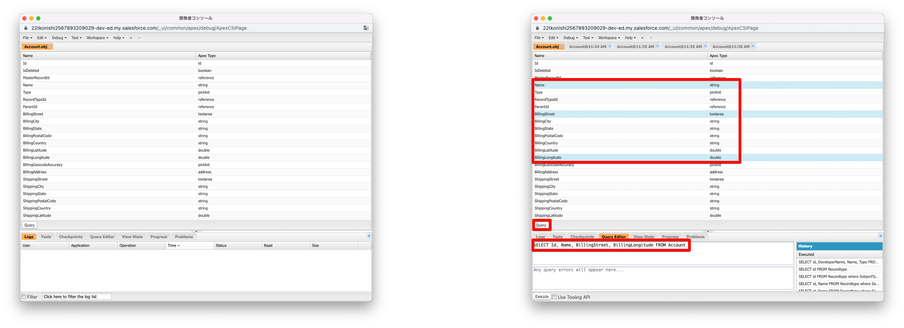

<!-- _paginate: false -->
<!-- theme: gradient class: blue-->
<!-- theme: freud class: blue-->

# 開発者コンソールについて <!-- fit -->

</br>
</br>


##### スライド:https://tkonishi5515.github.io/Developer_Console/ja/index

##### リポジトリ:https://github.com/tkonishi5515/Developer_Console

---

# はじめに

#### 今回の話すこと

- 使い方をデモを含めて共有します
- vsCode の方が優れているところを共有します
- vsCode の詳細な設定方法は説明しません

---

# トピックス

1. 開発者コンソールとは
2. 開発者コンソールでできること
3. ダミーデータ作成(テストデータ)→Apex コードの匿名実行
4. 実践(demo)
5. 星取り表？

---

# 開発者コンソールとは

## 基礎知識

[開発者コンソールの基礎](https://trailhead.salesforce.com/ja/content/learn/modules/developer_console)に使い方やできることは記載されています

## 開き方

みなさんも自分も Dev 環境などで、開いてみましょう

1. 設定のギアアイコンを押下する
2. 「開発者コンソール」と記載された箇所があるため押下する
3. 開発者コンソールが開かれる

---

# 開発者コンソールとは


---

# 開発者コンソールでできること

## Trailhead より抜粋

1. **Apex クラスやトリガー、Aura コンポーネント、Visualforce ページやコンポーネント**などに移動して作成・編集する
2. 組織で作成したパッケージを参照する
3. **デバッグ用のログを生成して、さまざまな視点から分析**する
4. 自分の **Apex コードをテストして、エラーがないことを確認**する
5. Apex コードにチェックポイントを設定し、エラーを特定して解決する
6. 組織のレコードを**検索、作成、更新する SOQL と SOSL クエリを記述して実行**する

→ 開発は、開発者コンソールで**ほとんど**行うことができる
(※現代の開発環境からはかけ離れていますが...)

---

# 開発者コンソールでできること

## **Apex クラスやトリガー、Aura コンポーネント、Visualforce ページやコンポーネント**などの作成を行う

- 画面左上の「File」を押下 →「New」を選択する
  

---

# 開発者コンソールでできること

### 作成できるコンポーネント

- Apex
- Visualforce
  - Visualforce Page:一つで Web ページが作成される
  - Visualforce Component:再利用可能な UI 部品
- 静的リソース(JavaScript)
- Lightning コンポーネント(Aura)
  - Lightning Application: 画面から作成するアプリケーションとは別物
  - Lightning Component:よく使う Aura コンポーネント
  - Lightning Interface:Aura で使用する共通処理を定義する
  - Lightning Event:コンポーネント同士をつなぐ
  - Lightning Tokens:Aura コンポーネント上のスタイルを一元で管理

---

# 開発者コンソールでできること

## **Apex クラスやトリガー、Aura コンポーネント、Visualforce ページやコンポーネント**などに移動して編集する

- 画面左上の「File」を押下 →「Open」を選択し編集したいクラスを開き編集する
  

---

# 開発者コンソールでできること

## 編集または、確認できるコンポーネント

- Apex
- Visualforce
- オブジェクト
  - 項目の API 参照名と、型が表示される
- 静的リソース
- パッケージ(メタデータ要素のグループ化)

---

# 開発者コンソールでできること



---

# 開発者コンソールでできること

## **デバッグ用のログを生成して、さまざまな視点から分析**する

- Apex はもちろん**フロー**のログも確認可能
  - 下記は取引先作成時に、年間売り上げ項目に「1」を追加するフロー


---

# 開発者コンソールでできること

## **デバッグ用のログを生成して、さまざまな視点から分析**する

## 開発をしない方もおすすめ！

### ログの注意点

- **ログインしているユーザのログのみ表示可能**
- デバッグログを仕込む必要なし(デバッグレベルは SFDC_DevConsole )
  - デバッグレベルも開発者コンソールで変更可能

---

# 開発者コンソールでできること

1. Debug → Change Log Levels を開く
2. General Trace Settings for You の「Add/Change」を押下
3. 変更したいデバッグレベルを選択する
   

---

# 開発者コンソールでできること

- 自分の **Apex コードをテストして、エラーがないことを確認**する

1. Test → New Run を開く
2. 対象のテストクラスと実行するメソッドを選択
3. 実行したテストクラスで通った箇所、カバレッジ率を確認可能


---

# 開発者コンソールでできること

組織のレコードを**検索、作成、更新する SOQL と SOSL クエリを記述して実行**する

1. Query Editor タブを押下
2. SOQL または SOQL を入力
3. 結果が表示されインライン編集可能


---

# ダミーデータ作成(テストデータ)

## ご自身の Dev 環境などでお試しください。

1. Debug → Open Execute Anonymous Window を押下(または ctrl + E)
2. Enter Apex Code というウィンドウが開きます


---

# ダミーデータ作成(テストデータ)

3. Enter Apex Code に下記コードを入力し、Execute を押下
4. 取引先に test0~test9 まで作成される

```Java
List<Account> acts = new List<Account>();
    for (Integer i = 0; i < 10; i++) {
      Account act = new Account();
      act.Name = 'test' + i;
      acts.add(act);
    }
    insert acts;
```

---

# おまけ

- LWC は Salesforce の外でも使用することが可能
- [lwc.dev](https://lwc.dev/)という web ページがあり、こちらに詳細が記載されている
- Heroku や web サーバーにデプロイすることで使用可能
- メインの HTML と JavaScript の書き方はほぼ同じ
- 興味のある方は「OSS LWC」などで検索してみてください

---

# まとめ

- Aura と LWC の違いはさまざまあるが、基本 LWC を使用しよう
- 画面フローで実装可能な場合は、画面フローで実装しよう
