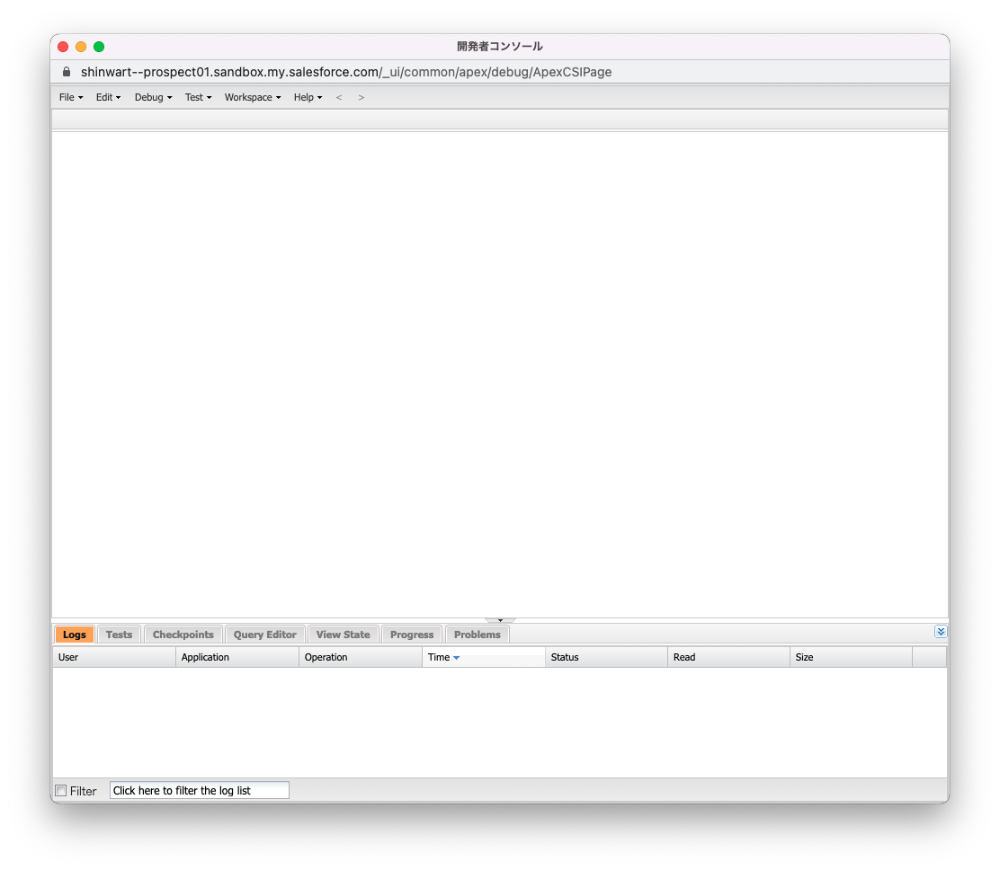
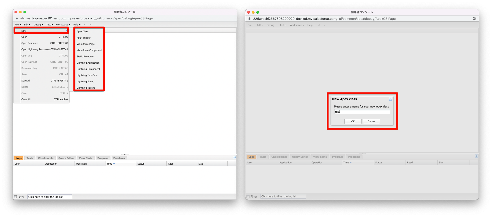
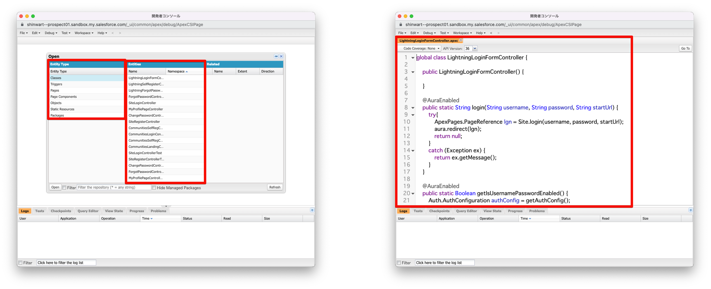

<!-- _paginate: false -->
<!-- theme: gradient class: blue-->
<!-- theme: freud class: blue-->

# 開発者コンソールについて <!-- fit -->

</br>
</br>


##### スライド:https://tkonishi5515.github.io/Developer_Console/ja/index

##### リポジトリ:https://github.com/tkonishi5515/Developer_Console

---

# はじめに

#### 今回の話すこと

- 使い方をデモを含めて共有します
- vsCode の方が優れているところを共有します
- vsCode の詳細な設定方法は説明しません

---

# トピックス

1. 開発者コンソールとは
2. 開発者コンソールでできること
3. 非開発者にもおすすめな機能
4. ダミーデータ作成
5. 実践(demo)
6. 星取り表？

---

# 開発者コンソールとは

## 基礎知識

[開発者コンソールの基礎](https://trailhead.salesforce.com/ja/content/learn/modules/developer_console)に使い方やできることは記載されています

## 開き方

みなさんも自分も Dev 環境などで、開いてみましょう

1. 設定のギアアイコンを押下する
2. 「開発者コンソール」と記載された箇所があるため押下する
3. 開発者コンソールが開かれる

---

# 開発者コンソールとは



---

# 開発者コンソールでできること

## Trailhead より抜粋

1. **Apex クラスやトリガー、Aura コンポーネント、Visualforce ページやコンポーネント**などに移動して作成・編集する
2. 組織で作成したパッケージを参照する
3. **デバッグ用のログを生成して、さまざまな視点から分析**する
4. 自分の **Apex コードをテストして、エラーがないことを確認**する
5. Apex コードにチェックポイントを設定し、エラーを特定して解決する
6. 組織のレコードを**検索、作成、更新する SOQL と SOSL クエリを記述して実行**する

→ 開発は、開発者コンソールで**ほとんど**行うことができる
(※現代の開発環境からはかけ離れていますが...)

---

# 開発者コンソールでできること

## **Apex クラスやトリガー、Aura コンポーネント、Visualforce ページやコンポーネント**などの作成を行う

- 画面左上の「File」を押下 →「New」を選択する
  

---

# 開発者コンソールでできること

### 作成できるコンポーネント

- Apex
- Visualforce
  - Visualforce Page:一つで Web ページが作成される
  - Visualforce Component:再利用可能な UI 部品
- 静的リソース(JavaScript)
- Lightning コンポーネント(Aura)
  - Lightning Application: 画面から作成するアプリケーションとは別物
  - Lightning Component:よく使う Aura コンポーネント
  - Lightning Interface:Aura で使用する共通処理を定義する
  - Lightning Event:コンポーネント同士をつなぐ
  - Lightning Tokens:Aura コンポーネント上のスタイルを一元で管理

---

# 開発者コンソールでできること

## **Apex クラスやトリガー、Aura コンポーネント、Visualforce ページやコンポーネント**などに移動して編集する

- 画面左上の「File」を押下 →「Open」を選択し編集したいクラスを開き編集する
  

---

# 開発者コンソールでできること

## 編集または、確認できるコンポーネント

- Apex
- Visualforce
- オブジェクト
  - 項目の API 参照名と、型が表示される
- 静的リソース
- パッケージ(メタデータ要素のグループ化)

---

# 開発者コンソールでできること


---

# なぜ Lightning Web Components を選択するのか

- 開発コミュニティが活発なため、新機能などに期待できる
- 標準的な JavaScript を使用することができるため、JavaScript の開発経験がある方は開発しやすい
  - そのため、学習コストが低い & Web 開発を行う際に役立つかも？
- LWC 開発時に必要なファイルの数が少なく、初期段階の理解が早い(個人差あり)
- (Aura,Visualforce と比べると)パフォーマンスが良い
- ただ pdf の作成や classic で動作させたいなどの場合 Visalforce の方が優れている箇所もある
- Visualforce も Javascript は使用できるため、RemoteAction などを使用すれば LWC のように使用可能

---

# なぜ Lightning Web Components を選択するのか

- LWC で作成されるファイル数

```markdown
プロジェクト名(任意で設定可能)
├ HTML
├ JavaScript
├ xml
├ css(任意)
└ Jest フォルダ
　　 └ プロジェクト名.test.js
```

---

# なぜ Lightning Web Components を選択するのか

- Aura で作成されるファイル数
  - 全部が必要なわけではないが。。。

```markdown
プロジェクト名(任意で設定可能)
├ auradoc
├ cmp(HTML)
├ cmp-meta.xml
├ css
├ design
├ svg
├ Controller.js
├ Helper.js
└ Render.js
```

---

# なぜ Lightning Web Components を選択するのか

```html
<template>
  <div slds-p-left_xx-large>{hello}</div>
</template>
```

```JavaScript
import { LightningElement } from 'lwc';

export default class Test extends LightningElement {
  hello = 'Hello,World!'
}
```

```xml
<?xml version="1.0" encoding="UTF-8"?>
<LightningComponentBundle xmlns="http://soap.sforce.com/2006/04/metadata">
    <apiVersion>56.0</apiVersion>
    <isExposed>true</isExposed>
</LightningComponentBundle>
```

---

# LWC を使用した案件紹介

1. Experience Cloud に B to C と B to B 向けの Web ページを開発

- B to C のページは独自のデザインだったため、CSS を使用していた
- B to B の方は LDS だったが、ソースレビューや GitHub で管理を行いたかったため LWC で開発をおこなった

2. ルックアップ検索条件に表示されるレコードの条件を変更したい

- 画面フローでは実装不可だったため LWC を使用した
- その後、保存ボタンを動的に動かしたり、項目全て入力されたら保存ボタンの色を変えたりと色々した

---

# 作成した Lightning Web Components の紹介

- 勉強会の環境に一部デプロイします

---

# おまけ

- LWC は Salesforce の外でも使用することが可能
- [lwc.dev](https://lwc.dev/)という web ページがあり、こちらに詳細が記載されている
- Heroku や web サーバーにデプロイすることで使用可能
- メインの HTML と JavaScript の書き方はほぼ同じ
- 興味のある方は「OSS LWC」などで検索してみてください

---

# まとめ

- Aura と LWC の違いはさまざまあるが、基本 LWC を使用しよう
- 画面フローで実装可能な場合は、画面フローで実装しよう
